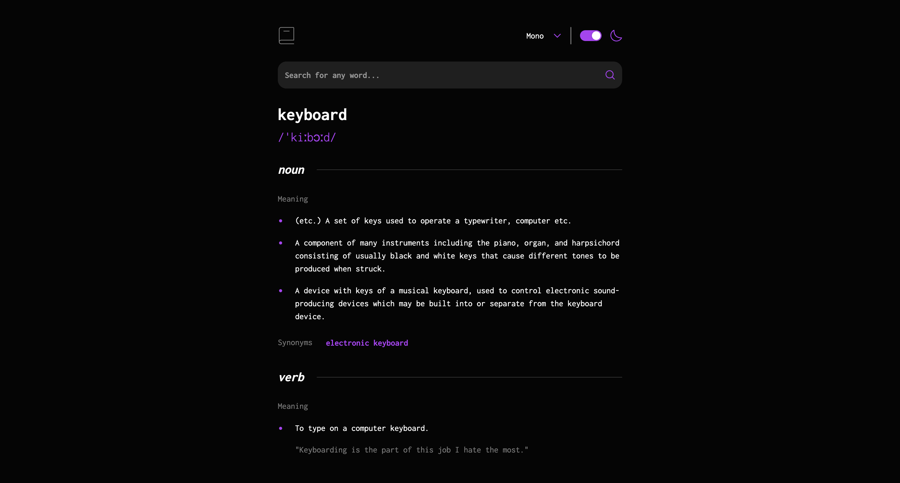

# Frontend Mentor - Dictionary web app solution

This is a solution to the [Dictionary web app challenge on Frontend Mentor](https://www.frontendmentor.io/challenges/dictionary-web-app-h5wwnyuKFL). Frontend Mentor challenges help you improve your coding skills by building realistic projects.

## Overview

### The challenge

Users should be able to:

- Search for words using the input field
- See the Free Dictionary API's response for the searched word
- See a form validation message when trying to submit a blank form
- Play the audio file for a word when it's available
- Switch between serif, sans serif, and monospace fonts
- Switch between light and dark themes
- View the optimal layout for the interface depending on their device's screen size
- See hover and focus states for all interactive elements on the page
- **Bonus**: Have the correct color scheme chosen for them based on their computer preferences. _Hint_: Research `prefers-color-scheme` in CSS.

### Screenshot

### Links

- Solution URL: [Frontend Mentor](https://www.frontendmentor.io/solutions/dictionary-web-app-vite-react-typescript-nMfNFGMN1_)
- Live Site URL: [Hosted on Vercel](https://dictionary-web-app-sigma-six.vercel.app/)

## My process

### Built with

- Vite
- React
- Typescript
- SCSS modules

### Useful resources

- [Dynamic theming through SCSS mixin](https://david-x.medium.com/light-mode-dark-mode-dynamic-theming-through-scss-mixin-c86e57a4de49) - This article helped me better understand how to use mixins in sass to generate themes.

## Author

- Frontend Mentor - [@jlyon12](https://www.frontendmentor.io/profile/jlyon12)

## Acknowledgments

- [CSS Reset by Josh Comeau ](https://www.joshwcomeau.com/css/custom-css-reset/)
